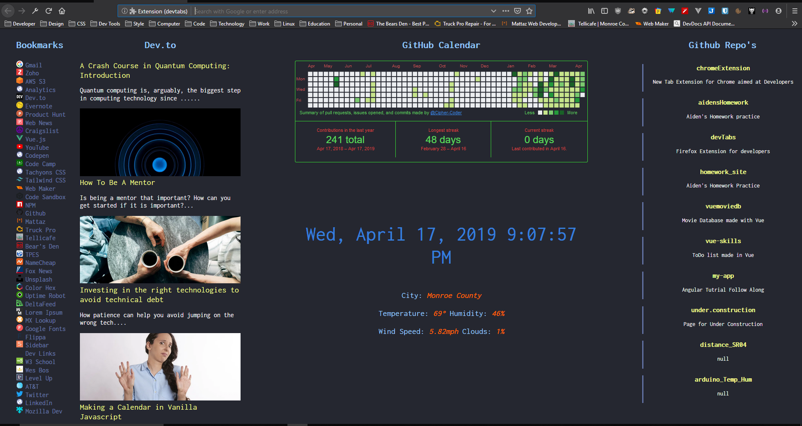

# devTabs

## Firefox extension for New Tab geared towards my Dev Work

This extension uses [Tachyons CSS](https://tachyons.io)

### Github Calendar

The Github calendar was integrated with, [github-calendar.js](https://github.com/IonicaBizau/github-calendar) from IonicaBizau. This was such a simple integration and it is documented very well.

I used the CDN link for this library and then I cut and pasted the CSS instead of loading another link. This also allowed me to change the styles and the original is not set for a dark background. The calendar is even responsive.

To change the calendar to your user-name, just go to the main.js file and the first line of code has the place for your user-name. Just change that to yours and your calendar will start showing up.

```js
new GitHubCalendar(".calendar", "Cipher-Coder", { responsive: true }); //Just change the 'Cipher-Coder' to what ever user you want to show up
```

### Github Feed

I also wanted a way to have easy access to my top Github repositories. So I found a another library appropriately called: [GithubFeed](https://github.com/samwx/GithubFeed) from samwx. This too has really simple integration and is documented very well. To change it so your repo's show up you would have to go into the main.js file and at line 4 you will see my user-name. Just change it to yours and your feed will begin to show up. There are some options there to that you can change.

### Bookmarks

I also wanted some of my most used bookmarks on the page. I made a small column down the side and had to hand code every link as I did not know how to set it up from the GUI to manually add them. Again, I am just learning. I will be looking into this more and once I figure it out I will integrate a way to just have maybe a simple form input that automatically finds the bookmark icon and pins it to the screen. But for now, to change the bookmarks that show up, you will have to manually go into the index.html file and change them by hand.

### Time and Date

Pretty self explanatory. Just a clock with the date. You can change some of the options if you want to. I had to change the weekday to just abbreviations so it did not feed down to the next line as I wanted the font a bit bigger. But you can change that back.

### Dev.to

This is now hooked up to the [dev.to](https://dev.to) API. I have been slowly tweeking the CSS to make it better. At first the 'card' elements were bleeding together, so I tried to give it some spacing. I also added and 'border-bottom' to break it up a bit. I had to figure out a way to not display the broken-link image for stories that did not had a img src. But just adding an alt="" attribute took care of it. 

### Weather

Lastly, I put some weather on the page. I used the [Open Weather Map API](https://openweathermap.org). They offer free API keys and I would ask that you get your own so I can continue to use mine. If you live somewhere that used metric or something other than imperial units, you can change how the data comes in by changing the end of the API call from imperial to what ever you may want. It is all commented in the main.js file.

## Here is a screenshot so you can see how it looks:

<p align="center">
  
</p>
